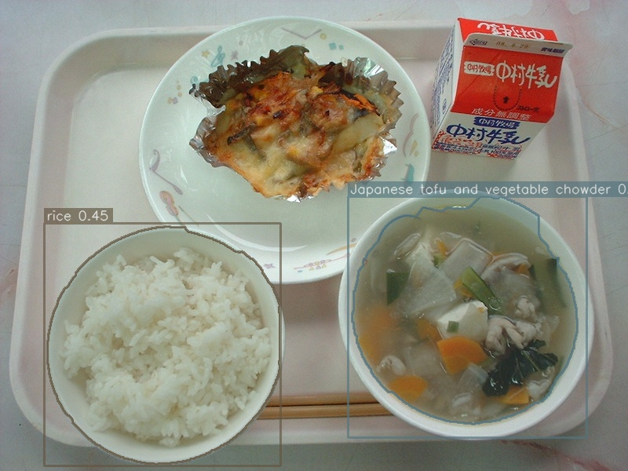

# Food Recognition & Nutrition Analyzer

   [](https://kaggle.com/datasets/b70f785b5f4e21301154def41a4a5205681567d9d502eedf5320049f5f16ad8e) 

End-to-end pipeline that estimates nutrition from a single meal photo.

- Detects foods with **YOLOv8**
- Builds masks (YOLO seg masks or **GrabCut** from boxes)
- Estimates **volume → weight** from **MiDaS** depth (plate-scaled, robust normalization)
- Converts weight to **calories, protein, carbs, fat** from a CSV
- Saves an annotated image and per-item / total CSVs per image

---

## Table of Contents
- [Examples](#examples)
- [Repository Structure](#repository-structure)
- [Trained Weights (Kaggle)](#trained-weights-kaggle)
- [Requirements](#requirements)
- [Quick Start](#quick-start)
- [Training (summary)](#training-summary)
- [Example Output (console)](#example-output-console)
- [Notes & Calibration](#notes--calibration)
- [Installation & Usage](#installation--usage)
- [License](#license)

## Examples

> Example annotated output:


### Results Breakdown
| food | weight_g | calories | protein | carbs | fat |
|---|---:|---:|---:|---:|---:|
| rice | 73.5 | 95.55 | 1.9845 | 20.727 | 0.2205 |
| Japanese tofu and vegetable chowder | 36.2 | 21.72 | 1.448 | 2.172 | 0.724 |


## Repository Structure

```
.
├─ datasets/
│  ├─ nutrition_256.csv                 # per-100g macros (food, calories, protein, carbs, fat)
│  └─ density_overrides_template.csv    # optional per-class densities (label, density)
├─ food256_yv8m_ddp_640/                # YOLO run folder (weights/best.pt lives here)
├─ out/                                 # pipeline outputs (created at runtime)
│  └─ <image_stem>/
│     ├─ <image_stem>_annot.jpg
│     ├─ results_breakdown.csv
│     └─ results_summary.csv
├─ documentation.md                     # extended docs
├─ nutrition_pipeline.py                # detection → depth → nutrition inference script
├─ readme.md                            # repo readme (this file)
└─ train_yolov8m.ipynb                  # training notebook (builds new_data/, trains YOLO)
```

> If your `best.pt` is elsewhere, update the `WEIGHTS` path in `nutrition_pipeline.py`.

---

## Trained Weights (Kaggle)

All artifacts produced by `train_yolov8m.ipynb` (including runs/weights) are available here:

**Kaggle Dataset**  
https://kaggle.com/datasets/b70f785b5f4e21301154def41a4a5205681567d9d502eedf5320049f5f16ad8e

Download and place `weights/best.pt` under your run folder (or point `WEIGHTS` to it).

---

## Requirements

- Python 3.9–3.11
- `pip install ultralytics torch torchvision opencv-python pandas numpy`

---

## Quick Start

1) Put your files in place:
- `datasets/nutrition_256.csv`
- `datasets/density_overrides_template.csv` (optional but recommended)
- `food256_yv8m_ddp_640/weights/best.pt` (or update `WEIGHTS` in the script)

2) Open **`nutrition_pipeline.py`** and set the CONFIG paths:
```python
BASE = r"E:\\Food Recognition & Nutrition Analyzer"
WEIGHTS = f"{BASE}/food256_yv8m_ddp_640/weights/best.pt"
NUTRITION_CSV = f"{BASE}/datasets/nutrition_256.csv"
DENSITY_CSV   = f"{BASE}/datasets/density_overrides_template.csv"
TEST_IMAGE = r"...path...\\your_image.jpg"
```

3) Run:
```bash
python nutrition_pipeline.py
```

**Outputs per image** (auto-created):
```
out/<image_stem>/
  <image_stem>_annot.jpg
  results_breakdown.csv
  results_summary.csv
```

---

## Training (summary)

- Dataset: **UECFOOD256** converted to YOLO under `new_data/{train,val,test}` (done in the notebook).
- Model: `yolov8m.pt`.
- You trained **50 epochs**, then **resumed +25 epochs**.
- Best weights were found at **epoch 1** of the resumed run; early-stopped at **epoch 21** due to `patience=20`.

The nutrition pipeline consumes `runs/.../weights/best.pt`.

---

## Example Output (console)

```
🖼️  Saved annotated image -> E:\\Food Recognition & Nutrition Analyzer\\out\\96\\96_annot.jpg
[DEBUG] px_to_cm ≈ 0.02793 cm/px  (image HxW=600x800)
[DIAG]                 rice | area_px= 83195 obj_med=2165.60840 ring_med=1518.26099 h95=958.10992 px_to_cm=0.02793 vol_cm3≈91.3 density=0.85 -> weight_g≈77.6
[DIAG]          boiled fish | area_px= 41978 obj_med=2456.50513 ring_med=2123.51904 h95=470.90112 px_to_cm=0.02793 vol_cm3≈48.6 density=1.02 -> weight_g≈49.6

Per-Food Breakdown:
           food  weight_g  calories  protein    carbs     fat
0         rice      77.6    100.88   2.0952  21.8832  0.2328
1  boiled fish      49.6     64.48  10.9120   0.0000  1.9840

Total Nutrition:
 {'calories': 165.36, 'protein': 13.0072, 'carbs': 21.8832, 'fat': 2.2168}

✅ Results saved as 'out/96/results_breakdown.csv' and 'out/96/results_summary.csv'
```

---

## Notes & Calibration

- Add realistic densities in `datasets/density_overrides_template.csv` (e.g., `rice=0.85`, `toast=0.27`, `noodles=0.55`).
- Tweak `expected_peak_cm` and `DEFAULT_PLATE_DIAM_CM` in the script for your camera/plates.
- Consider a YOLO **segmentation** model to skip GrabCut and improve masks.

---

## Installation & Usage

### Clone the repository

```bash
git clone https://github.com/AbdelrahmanElshatlawy/food-recognition-and-nutrition-analyzer.git
cd food-recognition-and-nutrition-analyzer
```

### Install dependencies

```bash
pip install ultralytics torch torchvision opencv-python pandas numpy
```

### Run the analysis

```bash
python nutrition_pipeline.py
```

---

## License

MIT (or your preference).

